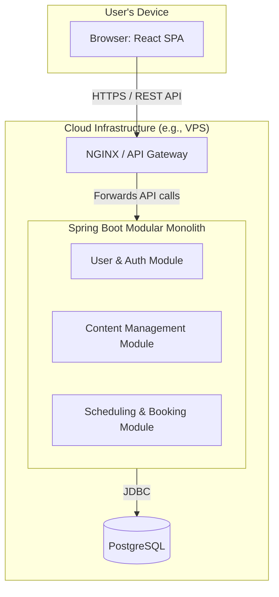

## 1. Overview

This document outlines the technical architecture for the **Coach's Personal Website & Booking Platform**. The project's primary goal is to provide a professional coach with a backend-driven personal website that serves as a professional online presence, a content platform (blog), and a simple, reliable system for clients to book sessions.

The purpose of this technical design is to provide a single source of truth for all architectural decisions, component responsibilities, and technical standards. It is a living document intended to guide development, ensure consistency, and facilitate the onboarding of new team members.

## 2. Guiding Principles & Architectural Pattern

### Architectural Pattern: Modular Monolith with a Decoupled Frontend (SPA)

For the MVP, we will adopt a **Modular Monolith** architecture for the backend. The frontend will be a standalone **Single Page Application (SPA)** that communicates with the backend via a RESTful API.

**Justification:**
*   **Simplicity of Deployment:** A monolith provides a single, deployable artifact, which simplifies our CI/CD pipeline and hosting infrastructure for the MVP.
*   **Strong Logical Boundaries:** By enforcing a modular structure within the monolith, we keep the codebase organized, maintainable, and prevent tight coupling between different business domains (e.g., content vs. booking).
*   **Avoids Premature Complexity:** This pattern avoids the operational overhead and distributed systems challenges of a microservices architecture, which would be an over-engineering for the current scale of the project. It also leaves the door open to extract modules into separate services in the future if required.

### Key Principles

1.  **Pragmatic & Simple First:** We will prioritize the simplest, most robust solution that meets the MVP requirements. We will avoid over-engineering and introducing unnecessary complexity.
2.  **Clear Module Boundaries:** Code related to a specific domain (e.g., User Management, Booking) must reside within its designated module. Cross-module communication should happen through well-defined service interfaces, not direct repository access.
3.  **Automate for Consistency:** Every part of the development and deployment lifecycle—from local environment setup (Docker) to database migrations (Flyway) and deployment—should be automated to ensure consistency and reduce manual error.

## 3. Technology Stack

| Category                 | Technology                           | Rationale / Purpose                                                              |
| ------------------------ | ------------------------------------ | -------------------------------------------------------------------------------- |
| **Backend Framework**    | Java 21 & Spring Boot 3              | A mature, robust framework for building secure, high-performance REST APIs.        |
| **Frontend Framework**   | React                                | A modern, component-based library for building dynamic and interactive user interfaces. |
| **Database**             | PostgreSQL                           | A reliable, open-source relational database that ensures data integrity.          |
| **Security**             | Spring Security & JWT                | Provides a robust framework for authentication and stateless, token-based authorization. |
| **Build Tool**           | Maven                                | Manages project dependencies and standardizes the build process for the backend.   |
| **Containerization**     | Docker & Docker Compose              | Ensures a consistent, isolated environment for development, testing, and production. |
| **Database Migrations**  | Flyway                               | Provides version-controlled, automated database schema management.                 |
| **DTO Mapping**          | MapStruct                            | Generates boilerplate mapping code between JPA entities and DTOs at compile-time.  |

## 4. System Components & High-Level Design

The system consists of a client-side application, a backend monolithic application, and a database. All communication between the client and backend is stateless and occurs over a secure REST API.

### Component Descriptions

*   **React SPA (Client):** The single page application responsible for all UI rendering and user interaction. It is a pure client that fetches all dynamic data from the backend API.
*   **NGINX / API Gateway:** Acts as a reverse proxy. It serves the static React application files and forwards all API requests (e.g., `/api/*`) to the Spring Boot backend. It also handles SSL termination.
*   **Backend (Modular Monolith):** The core of the application, built with Spring Boot. It enforces business logic, manages data persistence, and handles user authentication. It is internally organized into the following logical modules:
    *   **User & Authentication Module:** Manages user registration, login, profile data, and JWT generation/validation.
    *   **Content Management Module:** Handles the CRUD operations for blog articles and static pages (e.g., "About Me").
    *   **Scheduling & Booking Module:** Manages the coach's availability, the client booking process, and the data for the client dashboard.

## 5. Data Model

The core of our domain is modeled around four primary entities.

#### `users`
Stores information for both Coaches and Clients, differentiated by a role.
*   `id` (PK, UUID)
*   `name` (String)
*   `email` (String, Unique)
*   `password_hash` (String)
*   `role` (Enum: 'CLIENT', 'COACH')

#### `articles`
Represents a single blog post.
*   `article_id` (PK, UUID)
*   `title` (String, required)
*   `slug` (String, Unique, URL-friendly version of the title)
*   `content` (Text, required)
*   `excerpt` (Text, optional - short summary for list views)
*   `status` (Enum: 'DRAFT', 'PUBLISHED', 'PRIVATE', 'ARCHIVED')
*   `author_id` (FK to `users.id`, required)
*   `featured_image_id` (FK to `media.media_id`, nullable)
*   `created_at`, `updated_at` (Timestamps, required)
*   `published_at` (Timestamp, nullable - set when status changes to PUBLISHED)
*   *Relationships:*
    *   *Many-to-One with `users` via `author_id` (an author can have many articles).*
    *   *Many-to-Many with `tags` via `article_tags` join table (an article can have many tags, a tag can be applied to many articles).*
    *   *Many-to-Many with `users` via `private_article_permissions` join table (for private article access control - an article can be assigned to many users, a user can have access to many private articles).*

#### `tags`
Represents a content categorization tag.
*   `tag_id` (PK, UUID)
*   `name` (String, Unique, required)
*   `slug` (String, Unique, URL-friendly version of the name, required)
*   *Relationships:*
    *   *Many-to-Many with `articles` via `article_tags` join table (a tag can be applied to many articles, an article can have many tags).*

#### `available_slots`
Represents a time slot the coach has made available for booking.
*   `id` (PK, UUID)
*   `start_time` (Timestamp)
*   `end_time` (Timestamp)
*   `coach_id` (FK to `users.id`)
*   `status` (Enum: 'OPEN', 'BOOKED')
*   *Relationship: Many-to-One with `users` (a coach can have many available slots).*

#### `bookings`
Represents a confirmed appointment, linking a client to a specific slot.
*   `id` (PK, UUID)
*   `client_id` (FK to `users.id`)
*   `slot_id` (FK to `available_slots.id`, Unique)
*   `booking_time` (Timestamp)
*   *Relationships:*
    *   *Many-to-One with `users` (a client can have many bookings).*
    *   *One-to-One with `available_slots` (a slot can only be booked once).*

### Entity Relationships

#### Article Relationships

**Article ↔ Tag (Many-to-Many)**
*   **Join Table:** `article_tags`
*   **Purpose:** Categorize articles with tags for organization and filtering
*   **Columns:**
    *   `article_id` (FK to `articles.article_id`)
    *   `tag_id` (FK to `tags.tag_id`)
*   **Business Rule:** PUBLISHED articles with tags are available for all users (no persistence needed for this rule - it's enforced at the application level)

**Article ↔ User (Many-to-Many for Private Access)**
*   **Join Table:** `private_article_permissions`
*   **Purpose:** Control access to PRIVATE articles by assigning specific users
*   **Columns:**
    *   `article_id` (FK to `articles.article_id`)
    *   `user_id` (FK to `users.id`)
*   **Business Rule:** Only users listed in this join table can access articles with `status = 'PRIVATE'`. PUBLISHED articles are available to all users without requiring entries in this table.

**Article → User (Many-to-One for Author)**
*   **Foreign Key:** `articles.author_id` → `users.id`
*   **Purpose:** Track the author/creator of each article
*   **Business Rule:** Every article must have an author

## 6. API Design

The API serves as the formal contract between the frontend and backend.

*   **Style:** RESTful over HTTPS.
*   **Data Format:** JSON for all request and response bodies. We will use Data Transfer Objects (DTOs) to decouple the API from the internal database entities.
*   **Authentication:** Stateless authentication using JSON Web Tokens (JWT).
    1.  Clients authenticate via the `/auth/login` endpoint with credentials.
    2.  The server responds with a signed JWT.
    3.  The client must include this token in the `Authorization: Bearer <token>` header for all subsequent requests to protected endpoints.
*   **Versioning:** All API routes will be prefixed with `/api/v1/` to allow for future evolution without breaking existing clients.

### Key API Endpoints

| Method | Path                                   | Protection | Description                                            |
| ------ | -------------------------------------- | ---------- | ------------------------------------------------------ |
| `POST` | `/auth/register`                       | Public     | Register a new client account.                         |
| `POST` | `/auth/login`                          | Public     | Authenticate and receive a JWT.                        |
| `GET`  | `/api/v1/articles`                     | Public     | Get a list of all blog articles.                       |
| `GET`  | `/api/v1/schedule/availability`        | Public     | Get a list of all `OPEN` time slots.                   |
| `POST` | `/api/v1/admin/availability/slots`     | Coach      | Create a new available time slot.                      |
| `POST` | `/api/v1/bookings`                     | Client     | Book an available time slot.                           |
| `GET`  | `/api/v1/bookings/my-bookings`         | Client     | Get a list of the current client's bookings.           |
| `GET`  | `/api/v1/users/me`                     | Authenticated | Get the profile of the currently authenticated user.     |