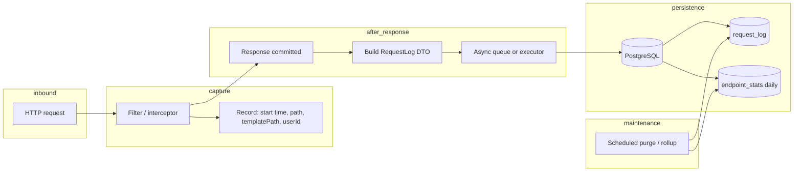

# REST request observability — high-level design

## 1. Purpose

Persist a durable record of HTTP API traffic so operations can:

- Measure **how many requests** were handled and how many completed as **success** vs **error**.
- **Debug production failures** using retained detail rows (path, template path, method, status, latency, user id, error code, message, stack trace when applicable).
- Track **long-term stability** via aggregates **per logical endpoint** (without relying on raw paths with varying IDs).

This document describes **what** to build and **why**. It does not specify implementation code.

---

## 2. Locked product decisions

The following choices are **fixed** for v1 unless explicitly revised.

| Topic | Decision |
|-------|----------|
| **Detail retention** | **Success** rows: **7 days**. **Failure** rows: **30 days**. |
| **Aggregate buckets** | **Daily** (`bucket_start` = UTC calendar day or agreed timezone day boundary). |
| **Aggregate retention** | **Indefinite** — rollup rows are not purged by the same jobs as detail tables. |
| **Detail row coverage** | **Every** in-scope request produces a `RequestLog` row (no sampling for successes). |
| **`/actuator/**`** | **Fully excluded** — no rows, no aggregate contribution. |
| **`/admin/**`** | **Errors only** — persist and count **only** non-success outcomes; **do not** log successful requests under this prefix. (Typically Spring Boot Admin under `/admin/sba/**`; see [§2.1](#21-path-prefix-rules).) |
| **Static / non-API** | **Skip** — do not log static assets, `favicon`, etc. |
| **Success definition** | **2xx only** — 3xx is **not** treated as success for metrics or retention class. |
| **401 / 403** | **One** aggregate column **`auth_error_count`**: both **401** and **403** increment the same bucket (not split). Separate from other **4xx**. Detail rows still store the real `status`. |
| **3xx and odd codes** | **Single lump** aggregate column **`other_non_success_count`** for responses that are **not** 2xx and **not** classified as auth (401/403), other **4xx**, or **5xx** — primarily **3xx** if the API emits them. |
| **Paths in detail** | Store **both** raw `path` and **`templatePath`**. **Query string:** not stored in v1 — see [§17](#17-query-string-decision-clarification). |
| **User identity** | **`userId`** — numeric internal user id only; **no** email, username, or other personal data in logs. Nullable when anonymous. |
| **Error payload** | **Both** stable **`errorCode`** and human-readable **`errorMessage`**; on error, persist **`stackTrace`**. **Truncation:** may cap at **64 KB** with an explicit suffix marker if longer (e.g. `\n... [truncated]`). |
| **Operations API** | **Read-only** admin HTTP API: **list**, **filter**, **pagination** over `RequestLog` (and optionally aggregate queries). |
| **Durability** | **Best-effort async** persistence — **loss of a bounded number of rows** on crash is **acceptable**; no transactional outbox required for v1. |

### 2.1 Path prefix rules

Clarification for implementers:

- **`/api/v1/**`** (including **`/api/v1/admin/**`**) — application REST API: **log every request** per the global rules (2xx = success class, etc.).
- **`/admin/**`** — infrastructure/UI mounted outside `/api/v1` (e.g. Spring Boot Admin): **errors only** (no `RequestLog` row for successful responses).
- **`/actuator/**`** — **no logging** to observability tables.

If new routes are added under `/admin/` that are not SBA, the **errors-only** rule still applies unless the design is updated.

---

## 3. Scope and assumptions

### In scope

- Application **REST controllers** under `/api/v1/**` (see [§6](#6-inventory-of-application-rest-endpoints-current-repo)).
- **`/admin/**`** as specified above (errors only).
- **`/actuator/**`** explicitly out of scope for persistence.

### Out of scope (for this design iteration)

- Full distributed tracing (trace IDs, spans across services) — can be added later if the monolith splits or you adopt OpenTelemetry.
- Storing response bodies (privacy, size, compliance).
- Real-time alerting rules (can consume the same DB or metrics later).

### Repository context

- **Runtime:** single Spring Boot application module (`personal-portal-application`) with PostgreSQL (`spring.jpa`, Flyway).
- **Controllers:** all `@RestController` API handlers live under `personal-portal-application/.../controller/` (including `admin` subpackage). Global API errors are handled via `@RestControllerAdvice` (e.g. `GlobalExceptionHandler` in `personal-portal-core`).

---

## 4. Goals


| Goal | Mechanism |
|------|-----------|
| Persist every in-scope API request log | Async enqueue + buffered batch insert: one `RequestLog` row per completed request (after response visible to filter), except where prefix rules skip success. Flush is triggered by configurable batch size or max flush interval. |
| Success vs error counts | From HTTP `status` and exception mapping; mirrored in **daily** aggregates with **auth (401/403)** split from **other 4xx**. |
| Retention by outcome | Purge **success** detail rows older than **7** days; **failure** rows older than **30** days. |
| Long-horizon stability | **Daily** aggregate rows keyed by **`templatePath`** + **method**, retained **indefinitely**. |


---

## 5. Non-goals and constraints

- **No personal data in logs:** use **`userId`** (Long, nullable) only; do not store email, name, or free-text identifiers.
- **Request body capture:** persist only sanitized JSON request bodies with sensitive fields masked (for example password/token/email/phone/name/address/birthDate); never persist raw personal data.
- **Header metadata capture:** persist sanitized request/response headers; sensitive headers (for example authorization, cookies, API keys, forwarding/IP headers) must be redacted before persistence.
- **Cardinality:** aggregates **must** use **`templatePath`** (same semantics as MVC pattern), not raw `path`.
- **Volume:** asynchronous buffered batch persistence so request threads are not blocked on DB I/O; flush policy must be configurable by both message count and max buffered time; **occasional loss** on failure is acceptable.
- **404 / unmatched routes:** capture at servlet filter when needed; `templatePath` may be sentinel (e.g. `UNKNOWN`) if no handler matched.
- **Stack traces in DB:** can be large; consider a **max length** in implementation if operations cap row size (not locked here).

---

## 6. Inventory of application REST endpoints (current repo)

The following list is derived from `@RequestMapping` / HTTP method mappings on `@RestController` classes in `personal-portal-application`. Path parameters are shown as `{param}` for clarity.

### Public (`/api/v1/public/...`)


| Method | Path |
| ------ | ------------------------------------------------ |
| GET | `/api/v1/public/agreements/dictionary` |
| GET | `/api/v1/public/agreements/{id}` |
| GET | `/api/v1/public/agreements/slug/{slug}` |
| GET | `/api/v1/public/booking/setting` |
| GET | `/api/v1/public/timezone` |
| GET | `/api/v1/public/session/type` |
| GET | `/api/v1/public/welcome` |
| GET | `/api/v1/public/more-about-me` |
| GET | `/api/v1/public/media/image/{mediaId}` |
| GET | `/api/v1/public/media/image/{mediaId}/thumbnail` |
| GET | `/api/v1/public/booking/available/slot` |
| GET | `/api/v1/public/articles` |
| GET | `/api/v1/public/articles/{articleId}` |
| GET | `/api/v1/public/articles/slug/{slug}` |


### Authentication & registration (`/api/v1/auth/...`)


| Method | Path |
| ------ | ------------------------------ |
| POST | `/api/v1/auth/login` |
| POST | `/api/v1/auth/registry` |
| POST | `/api/v1/auth/refresh` |
| POST | `/api/v1/auth/logout` |
| POST | `/api/v1/auth/forgot-password` |
| POST | `/api/v1/auth/reset-password` |


### User (authenticated user area)


| Method | Path |
| ------ | ---------------------------------------------- |
| GET | `/api/v1/user/profile` |
| PUT | `/api/v1/user/profile` |
| GET | `/api/v1/user/setting` |
| POST | `/api/v1/user/setting` |
| PUT | `/api/v1/user/setting` |
| POST | `/api/v1/user/account/activation/verification` |
| POST | `/api/v1/user/account/activation/code` |
| GET | `/api/v1/user/session/booking` |
| GET | `/api/v1/user/session/booking/group` |
| POST | `/api/v1/user/session/booking` |
| PUT | `/api/v1/user/session/booking/{id}` |
| POST | `/api/v1/user/session/booking/{id}/cancel` |


### Authenticated booking suggestions (same base as public articles in controller)


| Method | Path |
| ------ | -------------------------------------------- |
| GET | `/api/v1/booking/{bookingId}/available/slot` |


### Admin REST API (`/api/v1/admin/...`) — full logging (every request)


| Method | Path |
| ------ | -------------------------------------------------- |
| POST | `/api/v1/admin/user/registry` |
| GET | `/api/v1/admin/agreements` |
| POST | `/api/v1/admin/agreements` |
| PUT | `/api/v1/admin/agreements/{id}` |
| DELETE | `/api/v1/admin/agreements/{id}` |
| GET | `/api/v1/admin/booking/availability/override` |
| POST | `/api/v1/admin/booking/availability/override` |
| PUT | `/api/v1/admin/booking/availability/override/{id}` |
| DELETE | `/api/v1/admin/booking/availability/override/{id}` |
| GET | `/api/v1/admin/booking/availability/rule` |
| GET | `/api/v1/admin/booking/availability/rule/active` |
| POST | `/api/v1/admin/booking/availability/rule` |
| PUT | `/api/v1/admin/booking/availability/rule/{id}` |
| DELETE | `/api/v1/admin/booking/availability/rule/{id}` |
| POST | `/api/v1/admin/session/booking` |
| PUT | `/api/v1/admin/session/booking/{id}` |
| GET | `/api/v1/admin/session/booking/status/{status}` |
| GET | `/api/v1/admin/session/booking/group` |
| PUT | `/api/v1/admin/session/booking/status` |
| POST | `/api/v1/admin/media/image` |
| GET | `/api/v1/admin/media` |
| DELETE | `/api/v1/admin/media/image/{mediaId}` |
| POST | `/api/v1/admin/session/type` |
| PUT | `/api/v1/admin/session/type/{id}` |
| DELETE | `/api/v1/admin/session/type/{id}` |
| GET | `/api/v1/admin/session/type/all` |
| PUT | `/api/v1/admin/home` |
| GET | `/api/v1/admin/articles` |
| POST | `/api/v1/admin/articles` |
| PUT | `/api/v1/admin/articles/{articleId}` |
| DELETE | `/api/v1/admin/articles/{articleId}` |
| GET | `/api/v1/admin/booking/setting` |
| PUT | `/api/v1/admin/booking/setting` |
| GET | `/api/v1/admin/tags` |
| POST | `/api/v1/admin/tags` |
| PUT | `/api/v1/admin/tags/{tagId}` |
| GET | `/api/v1/admin/users` |
| GET | `/api/v1/admin/users/{userId}/settings` |


### User articles (authenticated list)


| Method | Path |
| ------ | ------------------ |
| GET | `/api/v1/articles` |


**Note:** Actuator lives under `/actuator/**` (not listed above). Spring Boot Admin UI is under `/admin/sba/**` — subject to **errors-only** logging, not this inventory.

---

## 7. Detail persistence: `RequestLog` entity

Suggested shape for **per-request** rows. Column names can be snake_case in SQL; Java uses camelCase.

```java
public class RequestLog {
    @Id
    @GeneratedValue(strategy = GenerationType.IDENTITY)
    private Long id;

    /** Raw servlet path (no query string). */
    private String path;

    /** MVC best-matching pattern; use for GROUP BY without path params. */
    private String templatePath;

    private String method;
    private Integer status;
    private Long durationMs;

    /** Internal numeric id only; null if unauthenticated / unknown. */
    private Long userId;

    private LocalDateTime createdAt;

    /** Stable API or domain error code when available. */
    private String errorCode;

    @Column(columnDefinition = "TEXT")
    private String errorMessage;

    @Column(columnDefinition = "TEXT")
    private String stackTrace;
}
```

### Field notes


| Field | Role |
| ----- | ---- |
| `path` | Raw **path** only (no `?query`). See [§17](#17-query-string-decision-clarification). |
| `templatePath` | Same key as aggregate dimension; Spring `BEST_MATCHING_PATTERN` or sentinel when unknown. |
| `method` | HTTP method. |
| `status` | Final HTTP status. |
| `durationMs` | Wall time from request accepted to response committed — define one rule and apply everywhere. |
| `userId` | Numeric internal user id only; **never** email or display name. |
| `createdAt` | Use **UTC** in storage unless the whole product standard is different; document for operators. |
| `errorCode` | Nullable; set on mapped errors when the API exposes a code. |
| `errorMessage` | Nullable; short explanation for operators. |
| `stackTrace` | Nullable; set when an error occurred; **truncate at 64 KB** if needed, with a clear marker. |


### Optional later columns

- `correlationId` / `requestId` — if request IDs are added to headers.
- `clientIp` — only if policy explicitly allows.

---

## 8. Success vs error semantics

- **Success:** HTTP **2xx** only.
- **Failure (detail retention “failure” class):** anything that is **not** 2xx for retention and error-field population (including 3xx, 4xx, 5xx).
- **Aggregates (daily):** maintain at least:
  - `total_count`
  - `success_count` (2xx)
  - `auth_error_count` — status **401** or **403** (single shared counter for both)
  - `client_error_count` — other **4xx** (excluding 401/403)
  - `server_error_count` — **5xx**
  - `other_non_success_count` — **locked:** non-success responses that are **not** 401/403, not other **4xx**, and not **5xx** — used for **3xx** (redirects, etc.) and any rare codes (e.g. **1xx**) if they appear
  - Latency rollups: e.g. `sum_duration_ms`, `max_duration_ms` (and optionally percentiles via detail sampling or future extension)

**Invariant:** `total_count` should equal the sum of the outcome columns above for each bucket row (adjust if you intentionally exclude certain requests from totals — not the case for `/api/v1/**` per current rules).

---

## 9. Path normalization and aggregates

- **Detail:** always persist **`templatePath`** alongside **`path`**.
- **Aggregates:** key = **`templatePath`** + **`method`** + **`bucket_start`** (day).
- **Fallback** when no handler: use a agreed sentinel **`templatePath`** (e.g. `UNKNOWN`) so charts remain stable.

Aggregates contain **counts and latency summaries only** — no `userId`, no error text.

---

## 10. Aggregate statistics model

- **Single primary rollup table** (daily buckets), retained **forever** (subject only to future archival policy).

Example logical columns:

`(bucket_start, method, template_path, total_count, success_count, auth_error_count, client_error_count, server_error_count, other_non_success_count, sum_duration_ms, max_duration_ms)`

**Update strategy (aligned with locked decisions):**

- Prefer **async** `RequestLog` insert, then a **scheduled job** (e.g. hourly or daily) that rolls **new** detail rows into **daily** buckets, **or** update aggregates incrementally from the capture path if latency is acceptable.
- Because **every** `/api/v1/**` request writes detail, rollup jobs must be **idempotent** or use high-water marks on `id` / `created_at` to avoid double counting.

---

## 11. Retention (detail only)

| Outcome class | Detail retention |
|---------------|------------------|
| Success (2xx) | **7 days** |
| Failure (non-2xx) | **30 days** |

- **Scheduled job** (e.g. daily): delete expired rows using `created_at` + success/failure classification.
- **Aggregates:** **do not** delete as part of this job.

Suggested configuration keys (values default as above):

- `observability.request-log.retention-success-days=7`
- `observability.request-log.retention-failure-days=30`

---

## 12. Ingestion architecture (conceptual)



**Rules at capture time:**

1. If path starts with **`/actuator/`** → **stop** (no row).
2. If path starts with **`/admin/`** and status is **2xx** → **stop** (no row).
3. If path looks like **static asset** (configured suffixes or `ResourceHttpRequestHandler`) → **stop**.
4. Else build `RequestLog` / aggregate update per rules.

**Placement:** **Filter** around the full chain for timing and status; read **`templatePath`** from request attributes when the dispatcher has set it.

---

## 13. Read-only admin API

Expose a **secured**, **read-only** REST surface (under `/api/v1/admin/...` or a dedicated namespace) for operators:

- **List** `RequestLog` with **pagination** (cursor or page/size).
- **Filters** (minimum useful set): date range, `status`, `templatePath`, `method`, `userId`, text search on `errorCode` / `errorMessage` (with sane limits).
- **No** create/update/delete of logs via API.
- **Authorize** strictly (e.g. admin role only).

Aggregates endpoint:

- `GET /api/v1/admin/observability/endpoint-stats/period`
- Required params: `from`, `to` (inclusive `LocalDate` range).
- Optional multi-value filters: `methods`, `templatePaths` (null/omitted means not filtered).
- Range rule: `from <= to` and the requested range must be no more than **one calendar month** (for example, `2026-08-15` to `2026-09-15` is valid).
- Grouping behavior:
  - when both `methods` and `templatePaths` are provided, group by `method + templatePath`,
  - when only `methods` are provided, group by `method` and ignore path dimension,
  - when only `templatePaths` are provided, group by `templatePath` and ignore method dimension.
- For each group, return summed counters across matched daily rows: `total_count`, `success_count`, `auth_error_count`, `client_error_count`, `server_error_count`, `other_non_success_count`.

---

## 14. Testing and validation

- Unit tests: classification (2xx success; 401/403 → shared auth bucket; other 4xx; 5xx; 3xx → `other_non_success_count`); `templatePath` resolution and sentinel.
- Integration tests: one `/api/v1/...` request → one row; `/actuator/health` → zero rows; successful `/admin/sba/...` → zero rows; failed `/admin/...` → one row.
- Load test: async path keeps latency within agreed SLO; acceptable loss under crash **not** asserted in CI unless you add chaos tests.

---

## 15. Rollout checklist

1. Flyway: `request_log` with indexes on `(created_at)`, `(template_path, created_at)`, `(status, created_at)`; daily aggregate table with unique constraint on `(bucket_start, method, template_path)` and columns including **`other_non_success_count`**.
2. Capture filter + async writer; populate `errorCode`, `errorMessage`, `stackTrace` (truncate **64 KB** with marker) from exception handler integration where possible.
3. Retention job: 7d / 30d; rollup job: daily buckets, indefinite storage.
4. Prefix rules: `/actuator/**` off; `/admin/**` success skip; static skip.
5. Read-only admin API with pagination and filters.
6. Document UTC vs local time for `bucket_start` and retention cutoffs.

---

## 16. Summary

The system persists **every** relevant API request in **`request_log`** with **`path`** (no query string) + **`templatePath`**, **`userId`** (numeric only), and rich **error** fields including **stack traces** (may truncate at **64 KB**). **Success** detail lives **7 days**, **failure** detail **30 days**. **Daily** aggregates by **`templatePath`** and **method** are kept **indefinitely**, with **401** and **403** sharing **`auth_error_count`**, other **4xx** in **`client_error_count`**, **5xx** in **`server_error_count`**, and **3xx** (etc.) in **`other_non_success_count`**. **`/actuator/**`** is excluded; **`/admin/**`** logs **errors only**; static assets are skipped. A **read-only** admin API supports **list / filter / pagination**. Persistence is **best-effort** async.

---

## 17. Query string decision (clarification)

**What the question meant:** For a request like `GET /api/v1/public/articles?page=2&tag=news`, the server receives:

- **Path:** `/api/v1/public/articles`
- **Query string:** `page=2&tag=news`

The design must decide whether to **persist the query string** anywhere in `RequestLog`.

**Why it matters:** Query parameters can carry **PII or secrets** (`?token=…`), create **high cardinality** in storage, and make grouping by endpoint harder unless normalized.

**Locked for v1:** Store **only** the path in **`path`** (and **`templatePath`** as today). **Do not** persist the raw query string. If a future need appears (e.g. abuse investigations), add an **optional**, **off-by-default** column (e.g. `querySanitized`) or rely on centralized HTTP access logs outside the app DB.
